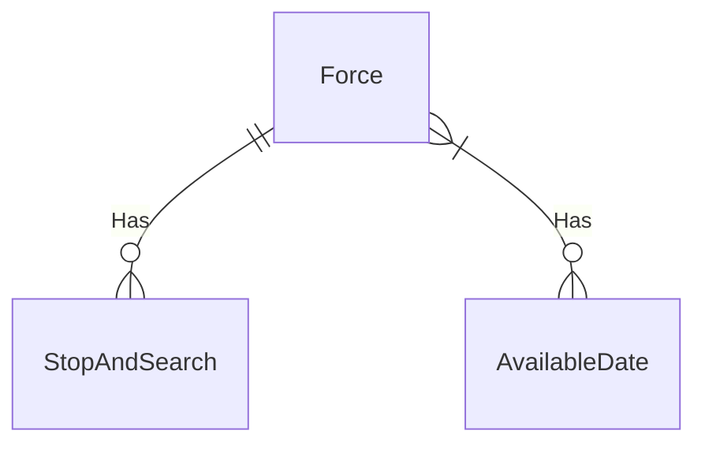
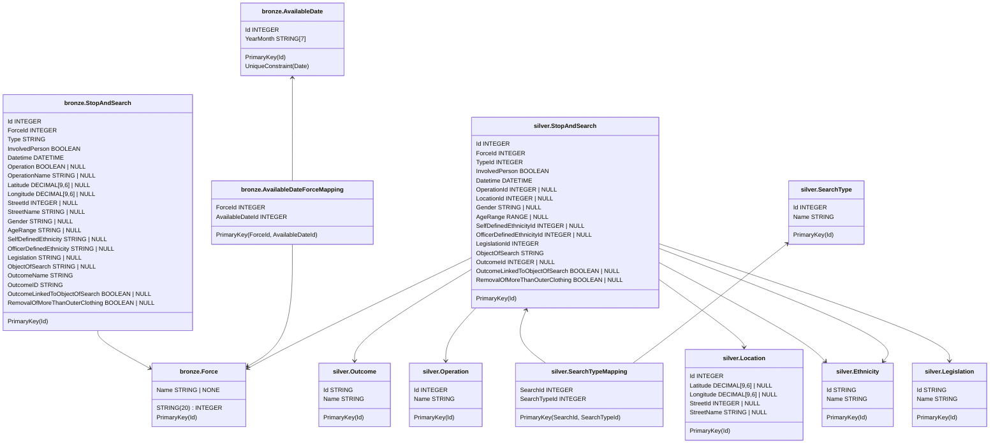

# Getting Started

## Prerequisites

Before running the project, ensure the following are installed:

1. **Docker** – Follow the [official documentation](https://docs.docker.com/engine/install/).
2. **VS Code** – Recommended for opening the dev container.
3. **Dagger** – Optional if not using the dev container. Install via [Dagger documentation](https://docs.dagger.io/getting-started/installation).

> **Tip:** The easiest setup is to open the project in a VS Code dev container. This automatically configures dependencies and development tools.

---

## Running the Project

The project uses Docker and Dagger to build and run containers for the database and the ingester.

### Step 1: Build Docker Images with Dagger

Run the following commands from the root of the repository:

```bash
# Build the ingester image
dagger call production-api-ingester --source . export-image --name police_api_ingester

# Build the database image
dagger call bronze-database --source . export-image --name police_api_database
```

> These commands generate Docker images on the host.

---

### Step 2: Start Containers

Once the images are built, run the containers using Docker Compose:

```bash
docker-compose up -d
```

This starts:

* **PostgreSQL database**
* **Police API ingester container**, scheduled to ingest stop and search data daily at midday for three forces leicestershire, nottinghamshire and derbyshire.

---

# Police API Ingester Package

The **Police API Ingester Package** is the core of the project, handling data ingestion from the UK Police Stop and Search API into PostgreSQL tables.

---

## Commands

The package provides two types of commands:

1. **`ingest`** – Runs ingestion immediately.
2. **`schedule`** – Schedules ingestion using cron notation.

All commands can be executed directly from the dev container or the Docker image.

```bash
police-api-ingester --help
```

> Running `--help` shows all available commands, options, and environment variable configurations.

---

### Scheduling

* Uses **APScheduler** and **Cronitor** to parse cron expressions.
* Schedule ingest commands by defining either environment variables or command-line options.

---

### Docker Image

To build a Docker image containing the ingester package:

```bash
dagger call production-api-ingester --source .
```

> This produces the image but does not make it runnable. To export it for use on the host:

```bash
dagger call production-api-ingester --source . export-image --name police_api_ingester
```

**Notes:**

* No entrypoint is set by default, allowing you to run specific commands.
* The container runs under the user `sgt_angle` for improved security (not as root).

---

### Scaling

* Commands can be run in separate containers to scale ingestion.
* Integrates easily with job schedulers like **Argo Workflows** or **Apache Airflow**.

---

### Command Options

* Options can be provided via the command line or environment variables.
* Refer to each command’s `--help` output for the corresponding environment variable names.

---

# Postgres Database

## Overview

The Police API Ingester is designed to store data in a PostgreSQL database using a **medallion architecture**. The database consists of:

* **Bronze tables:** Store raw data as returned by the API.
* **Silver tables:** Transform and normalize data for analysis and API access.

Alembic is used to manage database creation and migrations, with scripts generated using [SQLModel](https://sqlmodel.tiangolo.com/).

---

## Bronze Database

The bronze database mirrors the API structure for easy ingestion. This allows exploration of data fields to inform the design of more structured silver tables.

### Database Details

* **Type:** PostgreSQL
* **Rationale:** Open-source, supports SQL relationships, and is extensible.
* **Backup:** A backup can be exported with Dagger:

```bash
dagger call bronze-database-backup --source . export --path bronze-database.sql
```

* **Caching:** Databases can be cached to speed up repeated operations.

### Docker Image

Build the bronze database Docker image:

```bash
dagger call bronze-database --source . export-image --name police_api_database
```

---

## Development Environment

The project uses **VS Code Dev Containers** to provide a reproducible development environment.

### Setup

1. Open the project in VS Code. You should be prompted to open the project in a dev container.
2. If not prompted, use the command palette (F1, Ctrl+Shift+P, Cmd+Shift+P) and select `Dev Containers: Open Workspace in Container`.
3. The `post_create_command.sh` script automatically:

   * Installs Dagger
   * Installs development dependencies
   * Sets up the `police-api-ingester` package as editable

### Container Features

* **Docker-in-Docker** – Run containers inside the dev container
* **pytest** – Unit and integration testing
* **mypy** – Type checking
* **ruff** – Linting and code style enforcement
* **PostgreSQL Extension** – View the database within VS Code
* **Mermaid Extension** - visualise mermaid diagrams in preview within vscode

---

## Dagger Integration

Dagger is used to manage CI pipelines, tests, and developer commands.

* Installed via the post-create script in the dev container
* Version pinning prevents breaking changes
* Auto-completion commands are available for convenience

To list available Dagger functions:

```bash
dagger call --help
```

---

# Database Design

## ERD

An Entity-Relationship Diagram (ERD) was created to design the database schema. The bronze tables flatten API responses into single rows for storage, while silver tables normalize repetitive values.



## Tables Design

Bronze tables store raw data, and silver tables store normalized references for better searchability.



# Police API Analysis

## Stop and Search Routes

The Police API provides four main routes:

1. [By area](https://data.police.uk/docs/method/stops-street/)
2. [By location](https://data.police.uk/docs/method/stops-at-location/)
3. [No location](https://data.police.uk/docs/method/stops-no-location/)
4. [By force](https://data.police.uk/docs/method/stops-force/)

**Force filtering:**

* Only the last two routes support filtering by force.
* One includes location info, the other does not.

## Other Relevant Routes

1. **Availability** – Lists months with available data ([link](https://data.police.uk/docs/method/crimes-street-dates/))
2. **Forces** – Returns human-readable names and API IDs ([link](https://data.police.uk/docs/method/forces/))

## Rate Limits and Authentication

* **Authentication:** None
* **Rate Limiting:** 15 requests/sec, burst up to 30

## Python API Client

* An unofficial client exists but is outdated (Python 3.4, no updates in 11 years).
* Custom polling code is implemented for relevant routes.

