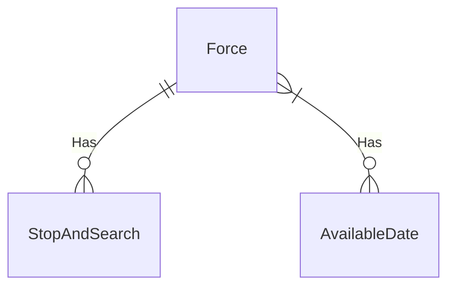

# Police Stop and Search Data Ingestion Project

This project creates a database for storing data from the [UK Police Stop and Search API](https://data.police.uk/docs/). The goal is to ingest and store stop and search data, enabling downstream analysis and API access. The main logic for this project lives in the [Police API Ingester Package](src/police_api_ingester). This package is designed to ingest data into different tables within a postgres database. Hence this project uses alembic to repetable create postgres databases, the migration scripts are available in the [alembic folder](alembic).

## Getting Started 

Before running the project the first thing to install is docker. This can be installed via the [documentation](https://docs.docker.com/engine/install/). The best way is to run it is by opening the dev container in vs code. Failing that install dagger via the [documentation](https://docs.dagger.io/getting-started/installation).

To Run the project you need to first run two dagger commands. To Produce images on the host
1. `dagger call production-api-ingester --source . export-image --name police_api_ingester`
1. `dagger call bronze-database --source . export-image --name police_api_database`

Once the images have been created it is possible to run the container with `docker-compose up -d`. This runs the database and an ingester containers. The ingester is schedule to ingest the stop and searches at midday every day.

## Police API Ingester Package

Each command runs different phases of the ingestion. These same commands can be ran from the produced docker container. This allows the project to scale by running seperate stages in seperate containers. These can be combinded with job schedulers suck as Argo Workflows, Apache airflow, etc... 

The commands within this package are ran using [typer](https://typer.tiangolo.com/tutorial/parameter-types/custom-types/). This allows you to document what each function does and the options and arguments. To understand what commands are available then run the command `police-api-ingester --help`.

The package itself has two types of commands `ingest` and `schedule`. The former runs the individal ingest methods straight away, the latter uses cron notation to schedule when to run ingest commands. For each of the commands the options can either be set within the entry point or by setting an enviroment variable. To find what environment variable to set for each option please consult the commands help menu.

The `schedule` commands uses [cronitor](https://pypi.org/project/cronitor/) and [APscheduler](https://pypi.org/project/APScheduler/) libraries to be able to parse strings in [cron](https://en.wikipedia.org/wiki/Cron) syntax and then schedule the ingest commands. 

### Police API Ingester Docker Image

To produce a docker container that contains this package you can call the dagger command `dagger call production-api-ingester --source .` from the root of the repo. This produces a container with the package inside. Note this will not return a runnable container. To make the container available in the hosts images you need to run `dagger call production-api-ingester --source . export-image --name police_api_ingester`. 

The image that is produced does not have an entrypoint set. This allows you to choose which one of the commands in the package to run. The image is run under the user `sgt_angle` this means that code is not ran under the root use and it is more secure.

## Postgres Database 

The package is designed to ingest data into a specific database. The database follows a **medallion architecture** with **bronze tables** mirroring the API structure. This allows analysis to determine whether fields are free text or constrained, informing the design of more searchable silver/gold tables. More information about the database design is available in the Database design section.

- **Database Type:** PostgreSQL  
- **Rationale:** Open-source, extensible, supports SQL relationships.  
- **Bronze Database Approach:** Store data as returned from the API.

Alembic is used to create the same database design. These scripts are generated using [SQLModel](https://sqlmodel.tiangolo.com/). 

There are dagger functions that will create a postgres database and then apply alembic scripts against them. Finally, a backup of the database is created this provides two funcitions.
1. It can be exported so that it can shared and other databases can be created. This can be achieved with `dagger call bronze-database-backup --source . export --path bronze-database.sql`
1. This allows database's to be stored in a cache volume allowing for repeated calls of functions to speed up.

To produce a docker image on the host then run the command `dagger call bronze-database --source . export-image --name police_api_database`.

## Development Environment

This project uses [VS Code Dev Containers](https://code.visualstudio.com/docs/devcontainers/containers) to provide a reproducible development environment. If you are unfamiliar with them then please read the documentation on how to setup.

It is advised that you open this project in vscode. When you open vscode you should be prompted to open the project in a dev container. If this does not prompt you open the command palette (f1, Ctrl+Shift+P, Cmd+Shift+P) and select `Dev containers: open workspace in a container`.

The dev container has a [post_create_command.sh](.devcontainer/post_create_command.sh) script for configuring the container. This installs dagger into the container, installs the development dependencies in container and creates the police-api-ingester package as an editable package. This means that commands can be run within the dev container by calling `police-api-ingester`. 

### Container Features
The dev container is configured with the following features:  
1. **Docker-in-Docker** – Allows running containers inside the dev container.  
2. **pytest** – For unit and integration testing.  
3. **mypy** – Enforces strong typing in Python code.  
4. **ruff** – Enforces linting and code style.
5. **Postgres Extension** - Allows you to view the database within vscode.

## Dagger Integration

This project uses [Dagger](https://dagger.io/) to manage CI pipelines, tests and other useful developer commands.

- Installed via a **post-create script** in the dev container.  
- Script allows version pinning to prevent breaking changes.  
- Auto-completion commands for Dagger are also installed for ease of use.  

To understand more about what dagger functions are available it is best to run the `dagger call --help` command. This will return all the functions specfic for this project. These functions are documented using the [inline documentaion](https://docs.dagger.io/extending/documentation).

# Database Design

This explains more about the database design. Currently only the Bronze database is implemented.

## ERD

To figure out how to design a database first an ERD is needed to understand the relationships between the data. The ERD that was created for the Police API stop and search data is as follows:

This lead to the following database design for the tables. This effectively flattens the response from the stop and search database into a single row in the database for the bronze tables. The silver tables then pulls out the data that has the same values and assigns an id to them this makes it easier to search by similar fields.

## Tables Design

## Silver Database Design 

After ingesting the data into the bronze database it became a lot clearer what the design of the tables should be to allow an API to be built on it. Some of the silver tables are going to be joined to the bronze tables. For example the Forces are not going to be changed in the transform process, it is pointless recreating the tables and storing the same data twice. 

``

# Police API Analysis

## Stop and Search Routes

The Police API provides four main routes for stop and search data:

1. [Stop and searches by area](https://data.police.uk/docs/method/stops-street/)  
2. [Stop and searches by location](https://data.police.uk/docs/method/stops-at-location/)  
3. [Stop and searches with no location](https://data.police.uk/docs/method/stops-no-location/)  
4. [Stop and searches by force](https://data.police.uk/docs/method/stops-force/)  

All routes return a similar response object.  

### Filtering by Force

- The first two routes **cannot** filter by police force. Since user-defined force filtering is a requirement, these routes are not used.  
- The last two routes **can** be filtered by force:  
  - Searches **with a location**  
  - Searches **without a location**  
- Both routes return stop and search data; one includes location information, the other does not.

## Other Relevant Routes

1. [Availability](https://data.police.uk/docs/method/crimes-street-dates/)  
   - Returns a list of months when stop and search data is available.  
   - Helps optimize ingestion by skipping unavailable months.  

2. [Forces](https://data.police.uk/docs/method/forces/)  
   - Returns a list of forces with human-readable names and API IDs.  
   - Used to populate a `forces` table in the database.

## Rate Limits and Authentication

- **Authentication:** None required.  
- **Rate Limiting:** Leaky bucket method — 15 requests/sec, burst up to 30 requests. This will likely be the ingestion speed limit.

### Python API Client

- An unofficial [Python client](https://github.com/rkhleics/police-api-client-python/) exists but is outdated (Python 3.4, no updates in 11 years).  
- The project implements custom polling code for the four relevant routes.

